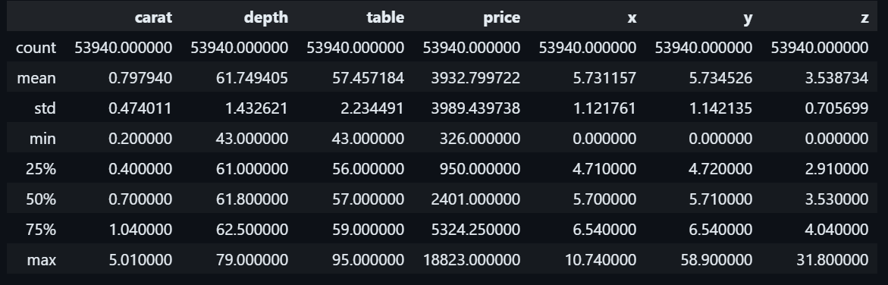
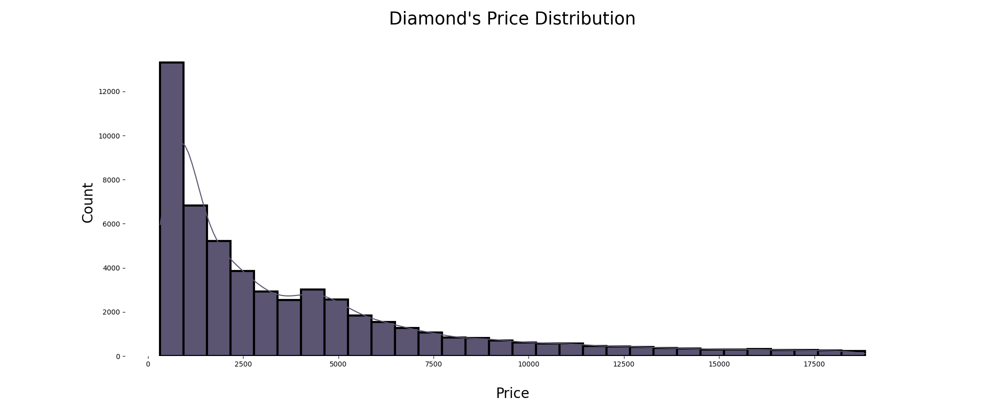

# Data Engineering Systems Course - Individual Project 1

### This repository contains Individual Project 1 for the Data Engineering Systems course. The project involves analyzing the Diamonds dataset using custom-built Python libraries, generating summary reports, and testing the functionality of these libraries.
## Project Overview
This project performs in-depth analysis of a dataset using various statistical techniques, implemented via custom Python libraries. It generates comprehensive reports on the full dataset and individual columns, including summary statistics, mode, and variance.

It utilizes the **Diamond Dataset** to perform descriptive statistics using **Pandas** on a **Jupyter Notebook**. It generates a comprehensive summary report, offering insights into the dataset's key attributes and statistical measures.
## Project Demo
[Click here to the proejct Demo](https://youtu.be/KxJ4oFML_dw?si=wUZlQHezbXDmpAVL)
## Repository Structure
- **mylib/**: Custom-built libraries for data analysis.
- **test_lib.py**: Tests for the libraries within mylib.
- **main.py**: Main script that utilizes the libraries to perform data analysis.
- **test_script.py**: Pytest-based tests for validating the functions.
- **main.ipynb**: Jupyter notebook that demonstrates the analysis of the dataset using the constructed libraries and generates a summary report in markdown format.
- **requirements.txt**: List of dependencies required for the project.
- **.devcontainer**: Configuration for a consistent development environment.
- **Makefile**: Automation of common tasks and commands.
- **.github**: GitHub Actions for continuous integration and deployment.
- **diamonds_summary.md**: a file that contains summary statistics of the diamonds dataset, it also contains a visualization of the distribution of diamonds prices.
> For a more comprehensive analysis of the dataset check my other repository [diamonds_dataset_analysis](https://github.com/monatagelsir7/diamonds_dataset_analysis)

## Summary Statistics

The figure below shows the dictribution of the prices of diamonds

