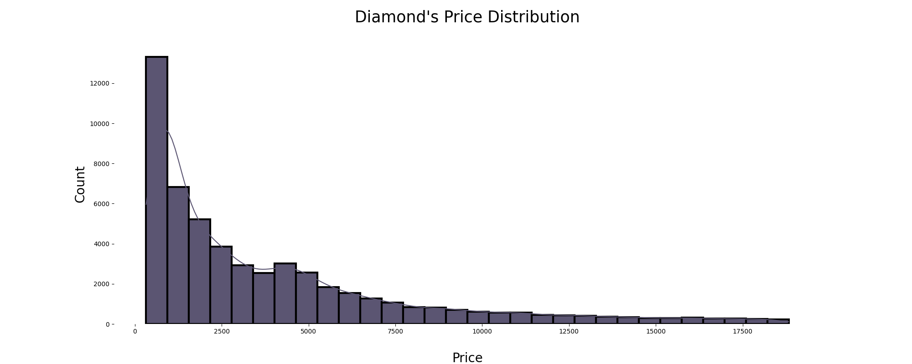

# Diamonds Dataset Summary Report

## Summary Statistics:
|       |        carat |       depth |       table |    price |           x |           y |            z |
|:------|-------------:|------------:|------------:|---------:|------------:|------------:|-------------:|
| count | 53940        | 53940       | 53940       | 53940    | 53940       | 53940       | 53940        |
| mean  |     0.79794  |    61.7494  |    57.4572  |  3932.8  |     5.73116 |     5.73453 |     3.53873  |
| std   |     0.474011 |     1.43262 |     2.23449 |  3989.44 |     1.12176 |     1.14213 |     0.705699 |
| min   |     0.2      |    43       |    43       |   326    |     0       |     0       |     0        |
| 25%   |     0.4      |    61       |    56       |   950    |     4.71    |     4.72    |     2.91     |
| 50%   |     0.7      |    61.8     |    57       |  2401    |     5.7     |     5.71    |     3.53     |
| 75%   |     1.04     |    62.5     |    59       |  5324.25 |     6.54    |     6.54    |     4.04     |
| max   |     5.01     |    79       |    95       | 18823    |    10.74    |    58.9     |    31.8      |

## Mode:
|    |   carat | cut   | color   | clarity   |   depth |   table |   price |    x |    y |   z |
|---:|--------:|:------|:--------|:----------|--------:|--------:|--------:|-----:|-----:|----:|
|  0 |     0.3 | Ideal | G       | SI1       |      62 |      56 |     605 | 4.37 | 4.34 | 2.7 |

## Variance and Standard Deviation:
**Variance:** 15915629.42430145

**Standard Deviation:** 3989.439738146379

## Diamond Price Distribution:

